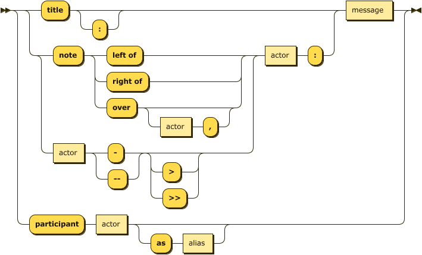

# Sequence 时序图



```sequence
A->>B: 你好
Note left of A: 我在左边
Note right of B: 我在右边
B-->A: 很高兴认识你
```

```sequence
bgbiao-> bianbian: good morning
note left of bgbiao: man
bianbian -> bgbiao: eat something
note right of bianbian: woman
  
note over bgbiao: test
```

```sequence
Andrew->China: Says Hello
Note right of China: China thinks\nabout it
China-->Andrew: How are you?
Andrew->>China: I am good thanks!
```

```sequence
Title: Here is a title
A->B: Normal line
B-->C: Dashed line
C->>D: Open arrow
D-->>A: Dashed open arrow
```

```sequence
# Example of a comment.
Note left of A: Note to the\n left of A
Note right of A: Note to the\n right of A
Note over A: Note over A
Note over A,B: Note over both A and B
```